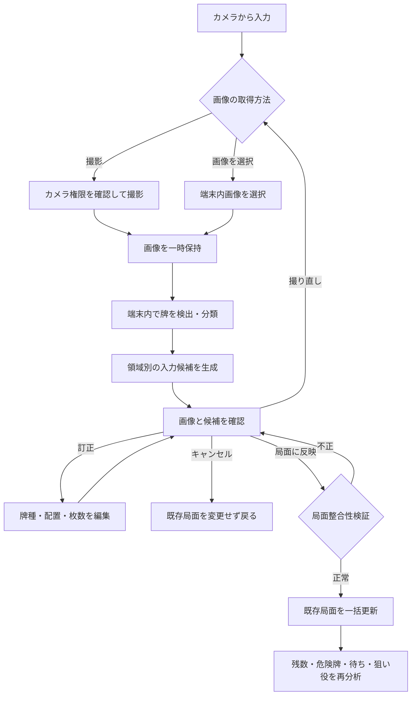
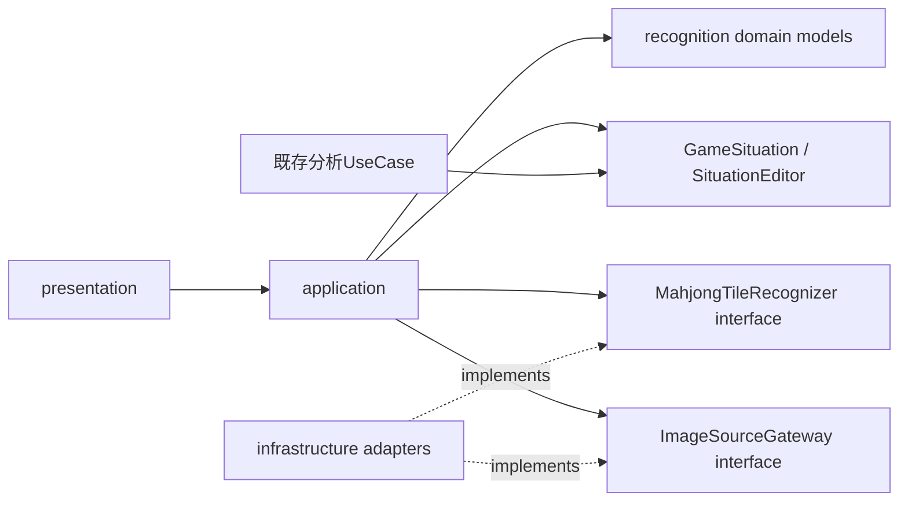
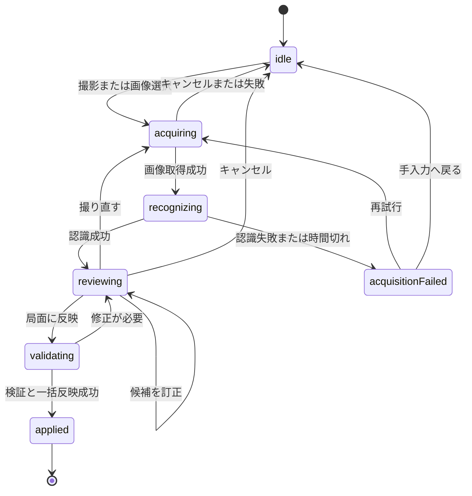

# Maohjong 静止画局面認識 基本設計書

## 1. 目的

スマートフォンで撮影した麻雀卓の静止画から牌を検出し、牌種と卓上の配置先を局面入力候補として生成する。認識結果は自動確定せず、利用者が画像と候補を照合して訂正・確定した後だけ、既存の局面入力と分析へ反映する。

有料APIや実行時の外部画像送信に依存せず、端末内推論を第一候補とする。画像取得、牌認識、配置候補生成、確認、局面反映を分離し、将来の動画入力でも認識部分と局面変換部分を再利用できる構造にする。

## 2. 対象Issue

- GitHub Issue #15「静止画から麻雀の局面を認識して入力候補を生成する」

## 3. 対象範囲

### 3.1 含めるもの

- Android端末のカメラによる静止画撮影
- 端末内に保存された画像の選択
- 画像内の複数の麻雀牌の検出
- 萬子、筒子、索子、字牌の34種類への分類
- 検出位置に基づく次の領域への仮配置
  - 自分の手牌
  - 自分、上家、対面、下家の河
  - 自分、上家、対面、下家の副露
  - ドラ表示牌
- 認識した牌種、画像上の位置、信頼度、配置候補を持つ中間データ
- 撮影画像への検出枠、牌種候補、信頼度、配置候補の重ね表示
- 不明牌、低信頼度、配置先不明、同一牌4枚超過の表示
- 認識結果の追加、削除、牌種変更、配置先変更
- 既存の牌パレットを使った訂正
- 明示的な確定操作による既存局面への反映
- 撮り直し、キャンセル、手入力への復帰
- 権限拒否、画像取得失敗、認識失敗、変換失敗への案内
- 認識器を差し替え可能にするインターフェースとモック
- 端末内モデルと学習データの出典・ライセンス管理

### 3.2 含めないもの

- 動画のリアルタイム解析
- フレーム間の牌追跡、重複排除、手による遮蔽からの自動復元
- 相手の伏せた手牌など、画像に写っていない情報の推定
- 人物、手、点棒、サイコロ、点数表示の認識
- 認識結果の無確認での局面更新
- 危険牌、待ち、狙い役の既存分析規則の変更
- 有料クラウドAI APIの利用
- 利用者の明示操作を伴わない画像の外部送信

## 4. 前提と制約

- 一般的なスマートフォンを卓の上方または斜め上から向けて撮影する。
- 照明の反射、牌の重なり、手による遮蔽、画角外、回転、遠近変形によって認識精度は変動する。
- 1枚の静止画から、画像に写っていない過去の打牌順や手出し・ツモ切りは復元しない。
- 河の牌順は、同一領域内の座標を卓の向きに応じて並べた候補として提示し、確定前に利用者が確認する。
- 画像の最下段へ検出枠が達する牌は、自分の河より自分の手牌を優先して配置候補とする。
- 撮影角度によって固定境界へ届かない場合は、最下部で高さが揃って横並びになる3枚以上の検出群を手牌列として補正する。
- 画像中央の牌を無条件にドラ表示牌とはせず、中央付近かつ小さい検出枠だけをドラ表示牌候補とする。通常サイズの牌は対面の河を優先する。
- 赤5は現在の`Tile`に区別がないため、通常の5として扱う。赤5を区別する場合は別Issueでドメインを拡張する。
- 既存の`GameSituation`、`SituationEditor`、`MatchInputFlow`を局面の正とし、画像認識側に麻雀進行規則を複製しない。

## 5. 利用フロー



1. 利用者は開始前または局面補正から「カメラから入力」を選ぶ。
2. カメラ撮影または端末内画像の選択を行う。
3. 認識中は進捗表示とキャンセル操作を表示し、既存局面は変更しない。
4. 認識後、元画像上の検出枠と、領域別に仮配置した牌を表示する。
5. 不明牌、低信頼度、配置先不明、4枚超過を優先して訂正する。
6. 牌種の訂正には既存の牌画像パレットを使う。
7. 「局面に反映」を押すと、候補全体を検証する。
8. 検証成功時だけ既存局面を一括更新し、画面を局面入力へ戻す。
9. 確定済み局面を入力として、既存の残数、危険牌、待ち、狙い役分析を再実行する。

## 6. 画面設計

### 6.1 入力入口

- 開始前画面と対局中の局面補正導線に「カメラから入力」を追加する。
- 従来の手入力は常に利用でき、カメラ権限を許可しなくてもアプリを使用できる。
- 撮影と端末内画像選択を同じ入口から選択できるようにする。

### 6.2 認識結果確認画面

```text
┌──────────────────────────────┐
│ 静止画から局面を入力          │
│ [撮り直す]             [中止] │
├──────────────────────────────┤
│ 撮影画像                      │
│ ┌──────────────────────────┐ │
│ │ 検出枠・牌名・信頼度       │ │
│ └──────────────────────────┘ │
├──────────────────────────────┤
│ 要確認 3件                    │
│ [不明牌] [低信頼度] [4枚超過] │
├──────────────────────────────┤
│ [手牌] [自分河] [上家河] ...  │
│ 認識した牌を領域別に表示       │
│ タップ: 牌種変更 / 移動 / 削除 │
├──────────────────────────────┤
│ [牌を追加]      [局面に反映]   │
└──────────────────────────────┘
```

- 検出枠と領域別一覧の牌は選択状態を同期する。
- 低信頼度は色だけで示さず、アイコン、文言、数値を併用する。
- 信頼度はモデルの出力値であり、正しさの確率と断定しない。
- 小型画面では撮影画像と領域別一覧を縦スクロール可能にし、確定操作は到達しやすい位置に置く。
- 編集可能な牌は44論理ピクセル程度のタップ領域を確保する。
- Semanticsには牌名、配置候補、確認状態、利用可能な操作を含める。

### 6.3 訂正操作

- 牌をタップすると、既存の34種類の牌パレットを表示して牌種を変更できる。
- 配置先は領域一覧または選択メニューからワンタップで変更できる。
- 誤検出は削除でき、未検出は牌を追加して配置できる。
- 訂正後は4枚制限と領域別制約を再評価する。
- 訂正は認識候補だけを変更し、確定前の既存局面には影響させない。

## 7. アーキテクチャ

### 7.1 責務分離

```text
presentation
  StaticImageInputPage          撮影方法の選択と権限案内
  RecognitionReviewPage        オーバーレイ、警告、訂正、確定操作
  RecognitionTileEditor        既存牌パレットを使う候補編集

application
  RecognizeStaticImageUseCase   画像を認識器へ渡し候補を生成
  BuildRecognitionDraftUseCase 検出結果を領域別の下書きへ変換
  ApplyRecognitionDraftUseCase 下書きを検証し既存局面へ一括反映

domain
  RecognizedTile               牌種候補、位置、信頼度
  RecognitionDraft             確定前の領域別候補と警告
  RecognitionIssue             不明、低信頼度、配置不明、枚数超過
  GameSituation                確定後の既存局面
  SituationEditor              既存の牌数・局面制約

infrastructure
  ImageSourceGateway           カメラ撮影と画像選択の抽象化
  MahjongTileRecognizer        画像認識器の抽象化
  OnDeviceTileRecognizer       端末内モデルを使う実装
  ModelAssetMetadata           モデルと学習データの版・出典・ライセンス
```

### 7.2 依存方向



- UIはモデルの推論処理や局面変換規則を持たない。
- 認識器は`GameSituation`を直接更新しない。
- 局面変換UseCaseはFlutterのカメラAPIや推論ライブラリに依存しない。
- 既存分析UseCaseは認識途中の下書きを参照せず、確定済み`GameSituation`だけを受け取る。
- 画像取得方法と認識器はインターフェース越しに差し替え、テストではモックを使う。

## 8. データ設計

### 8.1 `CapturedImage`

- `localReference`: アプリ内部でのみ扱う一時画像参照
- `pixelWidth`、`pixelHeight`: 画像寸法
- `orientation`: 撮影時の向き
- `capturedAt`: セッション内の撮影時刻

永続的な外部パスをドメインへ渡さず、画面終了時に一時画像を破棄できる抽象参照とする。

### 8.2 `NormalizedRect`

- `left`、`top`、`width`、`height`: 0以上1以下の正規化座標

端末の解像度に依存せず、画像表示サイズが変わっても同じ検出枠を重ねられるようにする。

### 8.3 `RecognizedTile`

- `id`: 確認画面内で一意の識別子
- `tile`: 最上位の`Tile`候補。分類不能時は`null`
- `alternatives`: 代替の牌種候補と信頼度
- `boundingBox`: 画像上の正規化位置
- `confidence`: モデルの信頼度
- `suggestedRegion`: 推定した配置先。推定不能時は`unknown`
- `source`: モデル認識または利用者追加
- `editedByUser`: 利用者が訂正したか

### 8.4 `RecognitionRegion`

- `ownHand`
- `ownRiver`
- `upperRiver`
- `acrossRiver`
- `lowerRiver`
- `ownMelds`
- `upperMelds`
- `acrossMelds`
- `lowerMelds`
- `doraIndicators`
- `unknown`

### 8.5 `RecognitionDraft`

- 元画像のセッション参照
- 全`RecognizedTile`
- 領域別に並べた牌候補
- 警告一覧
- 認識器とモデルの版情報
- 未確定、検証済み、反映済みの状態

下書きは既存局面から独立させる。訂正中に`GameSituation`へ逐次反映せず、確定時に一つの操作として変換する。

### 8.6 `RecognitionIssue`

- `unknownTile`: 牌種不明
- `lowConfidence`: 信頼度が確認基準未満
- `unknownRegion`: 配置先不明
- `duplicateDetection`: 同じ牌を重複検出した疑い
- `tooManyCopies`: 局面全体で同一牌が5枚以上
- `invalidHandSize`: 手牌または副露を考慮した上限超過
- `unsupportedMeld`: 副露の組み合わせを確定できない

警告と確定不能エラーを区別する。低信頼度は利用者が確認すれば確定できるが、牌種不明、配置先不明、5枚目など既存局面へ変換できない状態は解消するまで確定できない。

## 9. インターフェース設計

### 9.1 `ImageSourceGateway`

- `captureStillImage()`: カメラで撮影する
- `selectExistingImage()`: 端末内画像を選択する
- `disposeTemporaryImage()`: アプリが作成した一時画像を破棄する

キャンセル、権限拒否、取得失敗を例外文言ではなく構造化した結果で返す。

### 9.2 `MahjongTileRecognizer`

- 入力: `CapturedImage`
- 出力: 検出した`RecognizedTile`の一覧と認識器の版情報
- 責務: 牌の検出、牌種分類、位置と信頼度の返却
- 非責務: `GameSituation`の変更、4枚制限、対局進行、分析

将来の動画版では、静止画と同じ画像フレーム型を入力できる認識インターフェースを再利用する。フレーム間追跡、同一物の識別、状態確定は別の動画追跡コンポーネントに置き、静止画認識器へ混在させない。

### 9.3 `BuildRecognitionDraftUseCase`

- 画像座標と卓の領域設定から配置候補を生成する。
- 領域内の牌を表示順の候補へ並べる。
- 信頼度、不明牌、不明領域、重複疑いを警告へ変換する。
- 撮影方向が判別できない場合は、利用者に自分の位置または画像の向きを選ばせる。

### 9.4 `ApplyRecognitionDraftUseCase`

- 未解決の確定不能エラーがないことを確認する。
- 既存`SituationEditor`の制約を使って4枚制限と局面整合性を検証する。
- 検証完了後にだけ局面全体を一括更新する。
- 失敗時は元の`GameSituation`を変更せず、修正可能な理由コードを返す。
- 反映後に既存の分析結果を直接編集せず、分析UseCaseを再実行させる。

## 10. 状態遷移



- 非同期処理中に画面が破棄された場合、遅れて返った結果を局面へ反映しない。
- 認識処理が制限時間を超えた場合はワーカーIsolateを停止し、失敗画面から再試行または手入力へ戻れるようにする。
- 同じ確定操作を連打しても二重反映しない。
- 撮り直し時は古い認識結果と画像参照を破棄してから新しい処理を開始する。

## 11. 認識と評価方針

### 11.1 処理段階

1. 画像の向きと解像度を正規化する。
2. 牌らしい矩形を物体検出する。
3. 各矩形を34種類へ分類する。
4. 画像座標と卓領域から配置先を推定する。
5. 領域ごとに牌の順序候補を組み立てる。
6. 局面制約を検査して確認画面へ渡す。

画像前処理、モデル読み込み、同期推論、後処理は一つの専用ワーカーIsolateで実行する。`OrtEnv`、`OrtSessionOptions`、`OrtSession`、入力テンソル、実行オプション、出力テンソルは、そのワーカー内で生成・利用・解放し、ネイティブポインタをIsolate間で共有しない。UI Isolateとの間では画像・モデルのバイト列、処理段階、ネイティブ資源を含まない認識結果だけを受け渡す。

認識器は25秒、画面は30秒を上限として待機する。認識器側の時間切れ、再試行、画面破棄ではワーカーを即時停止する。後処理はONNX出力の`[batch, channels, anchors]`と`[batch, anchors, channels]`の双方を受け付け、配列の向きを正規化してから検出候補へ変換する。検出候補は信頼度0.40以上を対象とし、IoU、小さい検出枠に対する重複率、枠サイズに対する中心距離を使って同一物の候補を除外する。診断ログには処理段階、経過時間、検出数、例外型、推論値を含まない出力形状とエラーコードだけを記録し、画像、端末内パス、推論テンソルの値、例外本文は記録しない。

牌の検出、牌種分類、領域割当を別々に評価し、一つの総合精度だけで品質を判断しない。

### 11.2 評価指標

- 牌検出: precision、recall、IoU、見逃し数、重複検出数
- 牌種分類: 34種類別のprecision、recall、混同行列
- 領域割当: 手牌、各河、副露、ドラごとの正解率
- 局面完成: 訂正なしで確定できた画像の割合
- 訂正負担: 1画像あたりの訂正回数と確定までの時間
- 性能: 画像選択から候補表示までの処理時間、最大メモリ、アプリサイズ増加

信頼度の確認基準と確定可否の閾値は設計時に固定値として断定せず、実際の卓、照明、端末、角度で収集した評価結果から決める。モデルの信頼度を正答確率として表示しない。

### 11.3 性能目標

- UIをブロックせず、認識中もキャンセルできる。
- 初期MVPはリアルタイム性ではなく、撮影から訂正候補を表示できる実用的な待ち時間を優先する。
- 目標処理時間、入力解像度、モデル容量は採用モデルの実機計測後に設計書へ追記する。
- 低メモリ端末で失敗する場合は、解像度縮小や分割推論を検討し、クラッシュさせず再試行または手入力へ案内する。

## 12. モデルと学習データ

- MVPでは`nikmomo/Mahjong-YOLO`のYOLO11 nano ONNXモデルを採用し、`onnxruntime`で端末内推論する。
- 入力は640×640のRGB画像、同梱ONNXの出力は37クラス（34種、赤5筒・赤5索・赤5萬）の41チャンネルとして扱い、赤5は既存の通常5へ正規化する。取得元READMEには不明クラスを含む38クラスの説明もあるが、同梱ファイルの埋め込みメタデータを正とする。
- モデル取得元コミットは`28ffceed232ad95fd019c47a6c51ae7c78791a0e`、重みのSHA-256は`3C7732C022D41C1A3F48CEA931CE626416D92486AB5B86692312941D0CC22226`とする。
- 画像取得は`image_picker 1.2.3`、前処理は`image 4.9.2`、推論は`onnxruntime 1.4.1`を利用する。
- 採用前に、コード、学習済み重み、学習データを個別にライセンス確認する。
- 商用利用、再配布、改変、表示義務がアプリの用途と配布形態に適合することを確認する。
- モデル名、版、取得元、取得時点、ハッシュ、ライセンスをリポジトリ内文書へ記録する。
- モデル配布元のMITライセンスは`assets/models/MAHJONG_YOLO_LICENSE.txt`、取得情報と公開前確認事項は`assets/models/MAHJONG_YOLO_SOURCE.md`へ記録する。学習データ自体の利用条件は公開前に再確認する。
- 既存のCC0牌画像はUI表示用であり、学習データとしての有効性を前提にしない。教師データへの利用は出典、利用条件、実写との差を別途評価する。
- 利用者の撮影画像を学習データとして保存・送信しない。将来収集する場合は、明示的な同意、用途、保存期間、削除方法を別Issueで設計する。

## 13. プライバシーと権限

- カメラ権限は撮影を選んだ時にだけ要求する。
- 権限を拒否されても、画像選択または従来の手入力を利用できる。
- 撮影画像と認識結果を、利用者の明示操作なしに外部へ送信しない。
- MVPでは画像を永続保存せず、確認終了、キャンセル、撮り直し、反映完了時にアプリが作成した一時画像を破棄する。
- 端末内画像を選択した場合、元画像は削除せず、アプリが必要な期間だけ読み取り参照する。
- ログへ画像本体、端末内パス、個人を識別し得る背景情報を出力しない。
- 診断情報は認識時間、検出数、警告種別、モデル版などの非画像メタデータに限定する。

## 14. エラー処理

| 状況 | 利用者への動作 | 局面への影響 |
| --- | --- | --- |
| カメラ権限拒否 | 設定案内、画像選択、手入力を提示 | 変更しない |
| 撮影・画像選択のキャンセル | 元画面へ戻る | 変更しない |
| 画像読込失敗 | 再選択または撮り直しを提示 | 変更しない |
| モデル読込失敗 | 再試行または手入力を提示 | 変更しない |
| 認識処理が時間内に完了しない | ワーカーを停止し、再試行または手入力を提示 | 変更しない |
| 牌を検出できない | 撮影のコツ、撮り直し、手入力を提示 | 変更しない |
| 一部が不明・低信頼度 | 該当候補を強調して訂正を促す | 確定まで変更しない |
| 同一牌が5枚以上 | 超過牌と配置先を表示して確定を禁止 | 変更しない |
| 手牌・副露の整合性不正 | 修正理由を表示して確定を禁止 | 変更しない |
| 確定中の予期しない失敗 | 元局面を保持して再試行を提示 | 部分更新しない |

利用者向け文言に内部例外、ファイルパス、モデル内部名を表示しない。開発ログにも撮影画像や画像内容を出力しない。

## 15. テスト方針

### 15.1 ドメイン・UseCaseテスト

- 34種類すべての認識結果を`Tile`へ対応付けられる
- 正規化座標が解像度に依存せず保持される
- 検出結果から手牌、4人分の河、副露、ドラ表示牌の候補を構築できる
- 不明牌、低信頼度、配置先不明を警告へ変換できる
- 同一牌5枚目と不正な手牌上限を確定前に拒否する
- 利用者訂正後に警告と並び順を再計算する
- 検証失敗時に既存`GameSituation`を変更しない
- 検証成功時に候補全体を一括反映する
- 反映後、既存の残数計算と分析UseCaseが確定局面を利用できる
- 同じ確定操作で二重反映しない

### 15.2 Widgetテスト

- 撮影と画像選択の入口を表示する
- 権限拒否から手入力へ戻れる
- 認識中に進捗とキャンセルを表示する
- 検出枠と領域別候補の選択が同期する
- 既存の牌画像パレットで牌種を訂正できる
- 候補の追加、削除、配置変更ができる
- 警告を色だけに依存せず表示する
- 未解決エラーがある間は確定できない
- 撮り直しとキャンセルで既存局面を保持する
- 360×640および文字倍率1.5で主要操作へ到達できる

### 15.3 認識器テスト

- 認識器をモックへ差し替え、UIと局面変換をモデル実装なしで検証する
- 採用モデルの固定評価画像セットで検出、分類、領域割当を再現可能に評価する
- 暗所、反射、斜め撮影、回転、部分遮蔽、牌の密集、空の卓を含める
- 評価画像の利用許諾と、リポジトリへの同梱可否を記録する
- モデル更新時に同じ評価セットで回帰比較する

### 15.4 品質・実機確認

- `dart format lib test`
- `flutter analyze --no-pub`
- `flutter test --no-pub`
- `git diff --check`
- Android実機で権限許可・拒否、撮影、画像選択、訂正、確定、キャンセルを確認する
- 複数の照明、距離、角度で認識結果と訂正負担を記録する
- 実機確認と単体・Widgetテストの結果を分けて報告する

## 16. 実装順序

1. 認識中間モデル、警告コード、認識器インターフェースを追加する。
2. モック認識器を使って認識結果確認・訂正画面を実装する。
3. 下書きから既存局面への変換・検証UseCaseを実装する。
4. 開始前画面と局面補正からの入口を接続する。
5. 画像選択アダプタと権限不要の画像入力を接続する。
6. カメラ撮影アダプタと権限処理を接続する。
7. 採用モデル、学習済み重み、学習データのライセンスと評価方法を確定する。
8. 端末内認識器を接続し、固定評価画像で検出・分類・領域割当を測定する。
9. 実機の卓画像で訂正負担と処理性能を確認し、信頼度基準を調整する。
10. 既存入力、進行、残数、危険牌、待ち、狙い役分析の回帰を確認する。

端末内モデルの選定や精度評価に時間が必要な場合でも、1から4を先に完成させることで、UI・責務境界・局面反映をモデルから独立して検証できる。

## 17. 将来の動画対応

動画対応では、静止画版の`MahjongTileRecognizer`と局面変換UseCaseを再利用し、次を別責務として追加する。

- カメラフレームの間引きとバックプレッシャー
- フレーム間の同一牌追跡
- 同じ牌の重複入力防止
- 手や牌で隠れた状態の一時保持
- 新しい打牌、ツモ、副露、ドラ追加の差分候補
- 時系列の整合性確認と利用者承認

動画からも局面を直接変更せず、「前状態からの変更候補」を生成し、信頼度が低い変更は利用者が確認してから反映する。静止画MVPに動画固有の追跡状態を持ち込まない。

## 18. 完了条件

- Issue #15の受け入れ条件を満たす
- カメラ撮影と端末内画像選択から認識候補を生成できる
- 34種類の牌、位置、信頼度、配置候補を中間モデルで扱える
- 手牌、4人分の河、副露、ドラ表示牌を確認・訂正できる
- 不明牌、低信頼度、配置不明、5枚目を確定前に確認できる
- 明示確定まで既存局面を変更せず、失敗時も部分更新しない
- 確定後に既存の残数、危険牌、待ち、狙い役分析を再利用できる
- 有料APIと無断の画像外部送信を必要としない
- モデル、重み、学習データの出典とライセンスが確認できる
- 新規・変更したDartコードに日本語Dartdocがある
- 静的解析、全テスト、差分検査が成功する
- Android実機で撮影から局面反映まで確認する

## 19. 関連設計書

- [Maohjong 基本設計書](design.md)
- [牌画像アセット 基本設計書](tile_image_assets_design.md)
- [対局開始前画面の簡略化 基本設計書](setup_screen_simplification_design.md)
- [対局開始後レイアウト 基本設計書](table_layout_design.md)
- [守備分析 基本設計書](danger_analysis_design.md)
- [対戦相手の狙い役・待ち牌推定 基本設計書](opponent_intent_analysis_design.md)
